# Genebuild statistics pipeline

The pipeline provides Busco, Omark completeness scores, calculates statistics for Ensembl website when the core database is available. 
If only the assembly accession and the taxon id are available the pipeline provide Busco score (mode=genome) for the assembly.


Nextflow version nextflow  >= version 24.10.3

## Busco pipeline `--run_busco_core`

Busco is a measure of completeness of genome assembly and annotation of the gene set. See the documentation for further details [BUSCO user guide](https://busco.ezlab.org/busco_userguide.html)

## OMArk pipeline `--run_omark`
  
OMArk is a software of proteome (protein-coding gene repertoire) quality assessment. It provides measure of proteome completeness, characterize all protein coding genes in the light of existing homologs, and identify the presence of contamination from other species.
Further information available in the official repo https://github.com/DessimozLab/OMArk

## Ensembl statistics and Beta Metakeys pipeline `--run_ensembl_stats, --run_ensembl_beta_metakeys`

The pipeline calculate core statistics for Ensembl browser.

## Busco NCBI genome pipeline `--run_busco_ncbi`

Option available to check the quality of the genome by running Busco in genome mode.

**Pipeline running parameters:**

## Input/output parameters [REQUIRED]:

Define key params the pipeline requires before initializing.

| Parameter | Description | Type | Required | Hidden |
|-----------|-----------|-----------|-----------|-----------|
| `enscode` | env ENSCODE path. | `string` | True |  |
| `bioperl` | Path to the directory containing the BioPerl library. | `string` | True |  |
| `outDir` | Output directory used to store finalized pipeline data. | `string` | True |  |
| `csvFile` | Path for the input csv file containing the db name(s). | `string` | True |  |

## General workflow parameters:

Parameters required for the workflow to be configured regarding optional processing.

| Parameter | Description | Type | Required | Hidden |
|-----------|-----------|-----------|-----------|-----------|
| `run_busco_core` | Run BUSCO given a mysql db. <details><summary>Help</summary><small>(protein or genome mode see '--busco_mode').</small></details>| `boolean` |  |  |
| `run_busco_ncbi` | Run BUSCO given a assembly_accession and taxonomy id in genome mode only. | `boolean` |  |  |
| `run_omark` | Run OMARK given a mysql db, default false | `boolean` |  |  |
| `run_ensembl_stats` | Run Ensembl statistics given a mysql db | `boolean` |  |  |
| `apply_busco_metakeys` | Create JSON file with BUSCO metakeys and load it into the db. | `boolean` |  |  |
| `apply_ensembl_stats` | Insert Ensembl statistics into a mysql db | `boolean` |  |  |
| `run_ensembl_beta_metakeys` | Run Ensembl beta metakeys given a mysql db. | `boolean` |  |  |
| `apply_ensembl_beta_metakeys` | Insert Ensembl beta metakeys into a mysql db. | `boolean` |  |  |
| `host` | Full mysql host database name. | `string` |  |  |
| `port` | Four digit port number for specified mysql DB host. | `integer` |  |  |
| `password` | Password for MYSQL write-enabled host connection. | `string` |  |  |
| `server_set` | Specific MYSQL write user. <details><summary>Help</summary><small>Related to host server specified: param '--host'.</small></details>| `string` |  |  |
| `team` | Required CoreDB meta_key for data team responsible. <details><summary>Help</summary><small>When 'run_ensembl_beta_metakeys' is enabled this key must be set.</small></details>| `string` |  |  |

## Optional parameters:

Optional parameters defined with defaults but can be altered.

| Parameter | Description | Type | Required | Hidden |
|-----------|-----------|-----------|-----------|-----------|
| `user_w` | DB write user name. | `string` |  |  |
| `user_r` | DB read_only user. | `string` |  |  |
| `project` | Project for the formatting of the output. | `string` |  |  |
| `metatable_keys` | Location of flat file (.txt) containing CoreDB meta table meta_keys. | `string` |  | True |
| `cacheDir` | The path where downloaded files will be cached. | `string` |  |  |
| `cleanCache` | Purge cache_dir if it exists. | `boolean` |  | True |

## Advanced parameters:

Important configuration setup. Not to be changed unless confident on config changes.

| Parameter | Description | Type | Required | Hidden |
|-----------|-----------|-----------|-----------|-----------|
| `canonical_only` | Enable 'canonical only' sequence dumps. | `string` |  |  |
| `ncbiBaseUrl` | Rest API for NCBI datasets v2alpha. | `string` |  | True |
| `genomio_version` | Ensembl-genomio Python library container. | `string` |  |  |
| `files_latency` | Sleep time (seconds) after genome and proteins have been fetched. <details><summary>Help</summary><small>Needed by several file systems due to their internal latency.</small></details>| `integer` |  | True |
| `mysql_cmds` | Location of HPS user mysql-cmds. | `string` |  | True |
| `mysql_ensadmin` | Default user mysql user. | `string` |  | True |

## BUSCO specific config setup:

Regulated/Hidden parameters not shown (show with --validationShowHiddenParams).

| Parameter | Description | Type | Required | Hidden |
|-----------|-----------|-----------|-----------|-----------|
| `busco_mode` | The mode in which to run BUSCO. <details><summary>Help</summary><small>If unspecified the pipeline runs in both genome and protein modes.</small></details>| `string` |  |  |
| `busco_dataset` | User override to explicitly specify the BUSCO dataset. <details><summary>Help</summary><small>Corresponds to a orthoDB lineage set.</small></details>| `string` |  | True |
| `busco_version` | BUSCO version to use. <details><summary>Help</summary><small>BUSCO version corresponding to docker container 'ezlabgva/busco:${params.busco_version}'</small></details>| `string` |  | True |
| `download_path` | Location of pre-downloaded lineage datasets. | `string` |  | True |
| `busco_datasets_file` | Location of pre-downloaded lineage datasets. | `string` |  | True |

## OMARK specific config setup.

Regulated/Hidden parameters not shown (show with --validationShowHiddenParams).

| Parameter | Description | Type | Required | Hidden |
|-----------|-----------|-----------|-----------|-----------|
| `omamer_database` | Location of Omark omamer_db on production file system. | `string` |  | True |
| `omark_singularity_path` | Location of Omark specific singularity SIF image. | `string` |  | True |


## Input Requirements

#### `--csvFile`
The structure of the file can change according to the running options
| Running mode | csv file format |
|-----------------|--------|
| --run_busco_core |  core (header)   | 
|                  |  <db_name>  |
| --run_omark |  core  (header)  | 
|                  |  <db_name>  |
| --run_busco_ncbi |  gca,taxon_id (header)   | 
|                  |  <gca>,<taxon_id>  |

For example tu run busco on a list of core dbs the file should be
|core |
|db1  |
|db2  |

### Workflow and Subworkflow DAGs:
The pipeline MAIN workflow 

RUN_BUSCO subworkflow:


RUN_OMARK subworkflow:


RUN_ENSEMBL_STATS subworkflow:


PREPARE_METADATA subworkflow:


#### Pipeline configuration
### Using the provided nextflow.config
We are using profiles to be able to run the pipeline on different HPC clusters. The default is `standard`.

* `standard`: uses LSF to run the compute heavy jobs. It expects the usage of `scratch` to use a low latency filesystem.
* `slurm`: uses SLURM to run the compute heavy jobs. It expects the usage of `scratch` to use a low latency filesystem.

#### Using a local configuration file
You can use a local config with `-c` to finely configure your pipeline. All parameters can be configured, we recommend setting these ones as well:

* `process.scratch`: The patch to the scratch directory to use
* `workDir`: The directory where nextflow stores any file

### Information about all the parameters

```bash
nextflow run ./ensembl-genes-nf/pipelines/nextflow/workflows/main.nf --help, --helpFull, --showHidden
```

#### Ensembl dependencies
These are the Ensembl repositories required by this pipeline:

| Repository name | branch | URL|
|-----------------|--------|----|
| ensembl | default | https://github.com/Ensembl/ensembl.git |
| ensembl-analysis | main | https://github.com/Ensembl/ensembl-analysis.git |
| ensembl-io | default | https://github.com/Ensembl/ensembl-io.git |
| ensembl-genes | default | https://github.com/Ensembl/ensembl-genes.git |

It is recommended that all the repositories are cloned into the same folder.

Remember that, following the instructions in [Ensembl's Perl API installation](http://www.ensembl.org/info/docs/api/api_installation.html), you will also need to have BioPerl v1.6.924 available in your system. If you do not, you can install it executing the following commands:

```bash
wget https://github.com/bioperl/bioperl-live/archive/release-1-6-924.zip
unzip release-1-6-924.zip
mv bioperl-live-release-1-6-924 bioperl-1.6.924
```

It is recommended to install it in the same folder as the Ensembl repositories.
